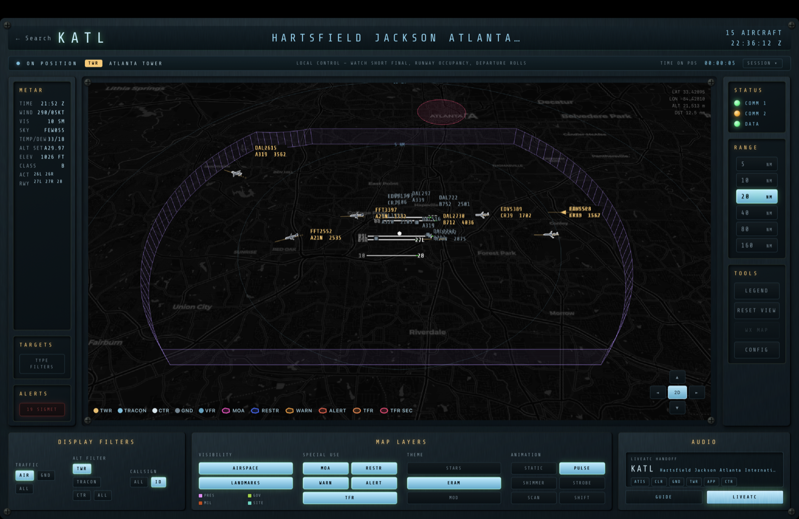
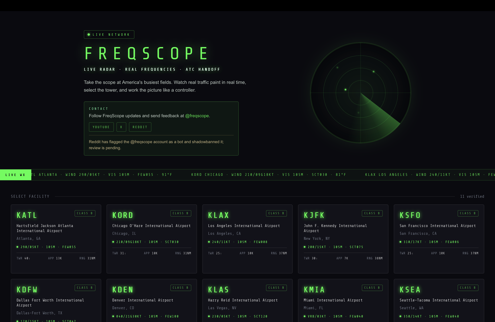

# FreqScope

**See live air traffic on a true 3D radar scope — and hear the controllers working it.**

Search any major US airport and watch real aircraft move through a three-dimensional scope built on a real globe. The airspace around the field — tower, TRACON, and center volumes, special-use areas, and active TFRs — is drawn as 3D shells you can tilt, orbit, and look inside, with traffic flying through them. One click opens a credited **Listen** handoff to [LiveATC.net](https://www.liveatc.net/), so you can watch the picture and hear the controllers at the same time.



## Why FreqScope

Air traffic simulators run pretend traffic. Flight trackers show real traffic on a flat 2D map. Nothing else puts **real live aircraft, a true 3D scope, real-world airspace you can see, and live ATC audio** together in one view.

FreqScope takes something most people only ever glimpse in a control room and makes it readable, explorable, and genuinely fun to watch — no aviation background required. It's both an education in how the sky is organized and a live window onto the traffic overhead.

## What it does

- **A true 3D scope** — built on a real 3D globe, not a flat map. Tilt, orbit, and zoom to see the airspace from any angle.
- **3D airspace volumes** — tower / TRACON / ARTCC boundaries, special-use airspace (MOA, restricted, warning, alert), and TFRs rendered as 3D shells you can look inside, with traffic flying through them.
- **Live ADS-B radar** — real aircraft positions polled every few seconds in a box around your selected airport.
- **Scope-style targets** — altitude-banded symbology (tower / TRACON / center / ground), VFR and emergency-squawk detection, data blocks, and trails.
- **Real-world map underlay** — terrain, city labels, and landmarks beneath the scope so the traffic has context.
- **Live weather** — METAR, plus SIGMET / G-AIRMET advisories for the area.
- **Selectable scope themes** — STARS, ERAM, and a modern light theme.
- **LiveATC handoff** — a credited **Listen** button that opens the airport's LiveATC page so you can hear the positions you're watching.
- **Optional 3D aircraft** — swap 2D symbols for 3D models on supported types (third-party assets, downloaded separately).

## Screenshots



## Get started

### Desktop app (no terminal required)

Download the installer for your platform ([all releases](https://github.com/strawmanode/freqscope/releases)):

| Platform | Download |
| -------- | -------- |
| **macOS** (Apple Silicon & Intel) | [DMG](https://github.com/strawmanode/freqscope/releases/latest/download/FreqScope-mac.dmg) · [ZIP](https://github.com/strawmanode/freqscope/releases/latest/download/FreqScope-mac.zip) |
| **Windows** (x64) | [Installer](https://github.com/strawmanode/freqscope/releases/latest/download/FreqScope-win.exe) |
| **Linux** (x64) | [AppImage](https://github.com/strawmanode/freqscope/releases/latest/download/FreqScope-linux.AppImage) |

Open the app and, on first run, enter your name and email when prompted — that's
all the live aircraft feed needs. No Node, no terminal, no commands.

> macOS/Windows may warn that the app is from an unidentified developer until
> the builds are code-signed. See [SETUP.md](SETUP.md#desktop-app) for how to
> open it and for signing notes.

### Run from source (developers)

```bash
npm install
cp .env.example .env.local   # then add your own name and email
npm run dev
```

To run the desktop app from source instead of a browser:

```bash
npm run electron:dev     # dev window with hot reload
npm run electron:build   # build an installer for your OS into release/
```

Airport, frequency, and airspace data ship prebuilt in `src/data/`. Run
`npm run build:data` only when you want to regenerate that data (requires FAA
NASR or OurAirports CSVs — see [`scripts/README.md`](scripts/README.md)).

Open [http://localhost:5173](http://localhost:5173). Full instructions —
including feed configuration, optional 3D models, data sources, and
troubleshooting — are in **[SETUP.md](SETUP.md)**.

> **Heads up:** the live aircraft feed requires you to identify yourself to
> upstream ADS-B providers. FreqScope prompts for your name and email on first
> run and won't start the feed until they're set. Details in
> [SETUP.md](SETUP.md#feed-configuration).

## Tech stack

Vite · React · TypeScript · React Router · Tailwind CSS · CesiumJS · static JSON · [airplanes.live](https://api.airplanes.live) (with [adsb.lol](https://api.adsb.lol) fallback)

## Project docs

- **[SETUP.md](SETUP.md)** — install, configuration, data, and scripts
- **[CONTRIBUTING.md](CONTRIBUTING.md)** — how to contribute
- **[SECURITY.md](SECURITY.md)** — reporting vulnerabilities
- **[NOTICE.md](NOTICE.md)** — third-party services, data, and license notices

## License & disclaimer

FreqScope is **source-available, not open source.** It is licensed under the
[PolyForm Noncommercial License 1.0.0](LICENSE) for personal, educational,
research, public-safety, government, charitable, and other non-commercial use.
Commercial use — selling, hosting, or bundling FreqScope as part of a paid
product or service — requires a separate license from the copyright holder.

The license covers only what the copyright holder can grant in FreqScope itself.
It does **not** grant rights to any third-party service, feed, audio stream,
dataset, photo, trademark, or content. FreqScope is provided "as is" and is
**not** for aviation, operational, law-enforcement, judicial, safety-critical,
or other reliance-based use. Users are responsible for complying with
[LiveATC.net's Terms of Use](https://www.liveatc.net/legal/) and the terms of
any other provider they access. See [NOTICE.md](NOTICE.md).
