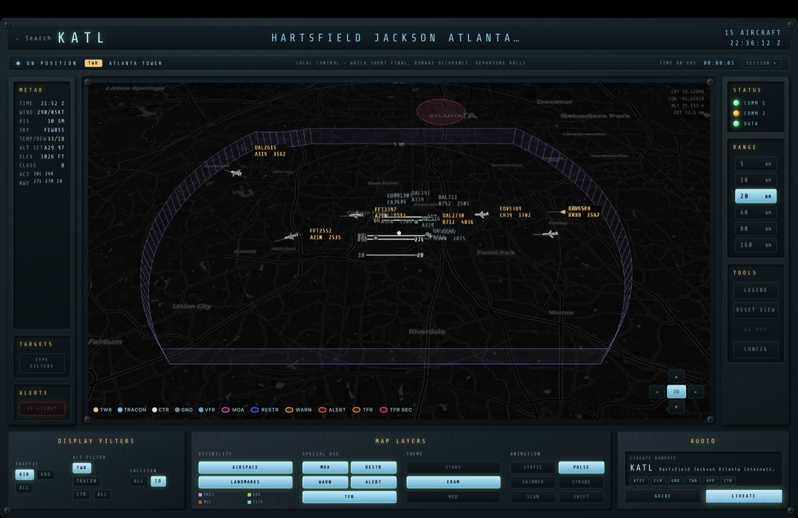
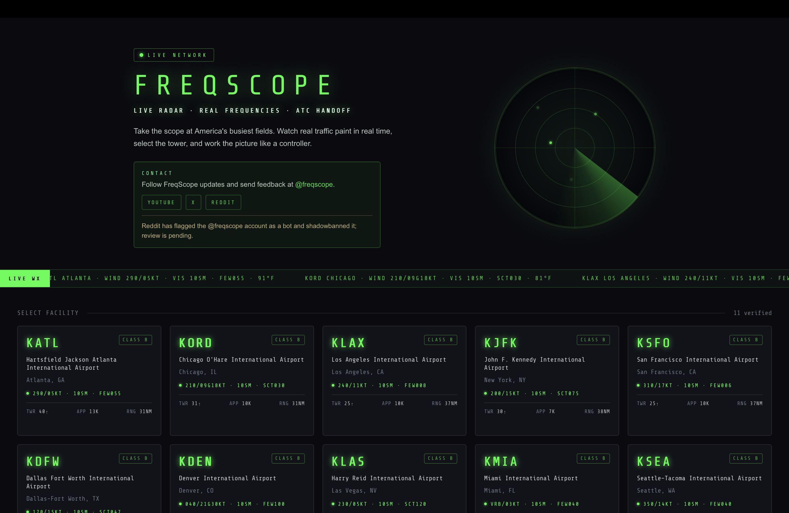

# FreqScope

[](LICENSE)
[](#development-status)

**Live air traffic on a 3D radar scope, with explorable airspace and a LiveATC handoff.**

FreqScope brings ADS-B traffic, 3D airspace, and airport radio-frequency information
into one view. Search an airport, explore tower, TRACON, and center volumes on a
Cesium globe, and open the matching [LiveATC.net](https://www.liveatc.net/) page.

## Development status

I've moved on to a more ambitious project and am no longer actively developing
FreqScope. The repository remains available for anyone interested in exploring
the code, learning from it, or building on it.

No further software updates, support, or review of issues and pull requests are
planned. Prebuilt desktop installers are no longer distributed. The final
reference-data snapshot remains available for existing installations; it is
not being refreshed.

## Screenshots

<p align="center">
  <a href="./screenshots/scope.png">
    
  </a>
</p>

<p align="center">
  <a href="./screenshots/search.png">
    
  </a>
</p>

## Features

- **3D radar scope:** a Cesium globe with tilt, orbit, zoom, and scope themes.
- **Airspace:** tower, TRACON, ARTCC, special-use airspace, and TFR layers.
- **Aircraft traffic:** ADS-B positions, data blocks, trails, and scope symbology.
- **Weather:** METAR, SIGMET, and G-AIRMET information.
- **LiveATC handoff:** a credited Listen button opens the airport's LiveATC page.
- **Desktop source:** an Electron app with a bundled local server.
- **Optional aircraft models:** separately downloaded third-party 3D assets.

External services and dependencies may change after development has ended.

## Run from source

Use Node.js 20 or newer and npm. For local use in a browser:

```bash
git clone https://github.com/strawmanode/freqscope.git
cd freqscope
npm ci
cp .env.example .env.local   # configure your own upstream feed identity
npm run dev
```

Open [http://localhost:5173](http://localhost:5173). The live aircraft feed needs
your own name and email for identification with its upstream providers. Never
commit `.env.local`. See [SETUP.md](SETUP.md#feed-configuration) for details.

To run or build the desktop app locally:

```bash
npm run electron:dev     # desktop development window
npm run electron:build   # local installer(s) in release/
```

These are local build instructions, not a maintained release service. See
[SETUP.md](SETUP.md) for configuration, packaging, and troubleshooting.

## Reference data

The [final reference-data snapshot](https://github.com/strawmanode/freqscope/releases/tag/data-latest)
was generated on **September 20, 2026 (UTC)**. It contains airport, runway,
frequency, and airspace data derived from OurAirports, the Squawk airspace
dataset, and project defaults. It is retained for existing installations, with
**no further refreshes planned**. Its data will become outdated.

The `data-latest` tag and download filenames are preserved for compatibility.
Existing desktop installations can retrieve this snapshot, or use their
previously downloaded or bundled reference data. Live aircraft and weather
requests are separate and remain subject to their providers' availability and
terms.

Prebuilt reference data also remains in `src/data/`. Instructions for generating
your own copy are in [scripts/README.md](scripts/README.md).

## Documentation

- [Setup and local builds](SETUP.md)
- [Data generation](scripts/README.md)
- [Optional aircraft models](public/models/aircraft/README.md)
- [Security maintenance status](SECURITY.md)
- [Third-party notices](NOTICE.md)

## License and disclaimer

FreqScope's own code is available under the [MIT license](LICENSE).
Third-party code, models, datasets, services, audio streams, and trademarks
remain subject to their own licenses and terms; see [NOTICE.md](NOTICE.md).

FreqScope is provided **as is** and is not intended for aviation operations,
navigation, safety-critical decisions, or other reliance-based use. Data may be
outdated, incomplete, or inaccurate. LiveATC use remains subject to
[LiveATC.net's Terms of Use](https://www.liveatc.net/legal/).
